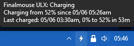
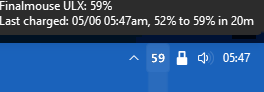
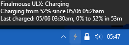
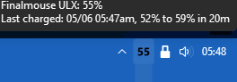
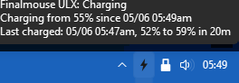

# Finalmouse Battery Tray

A lightweight Windows tray monitor for Finalmouse ULX battery status. It reads the receiver directly through native HID, displays the battery percentage beside your clock, and shows a pulsing bolt for charging or a wired USB power connection.

**Native mode needs no Chrome, Selenium, Xpanel login, or registry changes.** It polls every 10 seconds and saves your charge history and text-color preference locally.

## Install

You need Windows 10/11, **64-bit Python 3.10 or newer**, and a compatible Finalmouse ULX mouse and receiver. Python 3.11 is the tested version. Physical validation used a ULX Prophecy Tfue Wireless, Small, on Windows 11; other models and firmware have not all been verified.

1. Install [64-bit Python for Windows](https://www.python.org/downloads/windows/) if needed. Include the Python launcher or add Python to PATH.
2. [Download the project ZIP](https://github.com/saintordevil/finalmouse-battery-tray/archive/refs/heads/master.zip) and extract the complete folder to a permanent location. You can also clone this repository.
3. Double-click **`install.bat`**. Wait for **Installation complete**. It creates a local `.venv` and installs Pillow, pystray, and hidapi. Internet access is needed for this step.
4. Connect the receiver, turn on the mouse, and double-click **`start.bat`**.
5. If the icon is hidden, open the tray's hidden-icons arrow and drag it beside your clock.

For a launch without a console flash, double-click **`finalmouse_tray_silent.vbs`**. The launchers need Windows Script Host, use the environment beside them, and work with different usernames and folder paths. The installer does not install Python or alter your global Python packages. Native monitoring needs no network connection.

### Start with Windows

Create a shortcut to `finalmouse_tray_silent.vbs`. Press **Win+R**, enter **`shell:startup`**, and place the shortcut there. Keep the app in its permanent folder. Remove the shortcut to disable automatic startup.

### Upgrade

Choose **Quit** from the tray menu, or run **`stop.bat`**. Copy the new project files over your existing installation, preserving `.venv`, then run **`install.bat`** and **`start.bat`** again. If updating a Git checkout, preserve any local changes.

Settings and history live in `%LOCALAPPDATA%\finalmouse-tray`, separate from the app folder. Keep that data folder during upgrades. When moving to another PC or folder, run the installer there instead of copying `.venv`.

## Use

Hover over the tray icon for charge details. Right-click for:

| Control | Action |
|---|---|
| **Refresh** | Reopens the receiver and requests a fresh reading |
| **Reconnect Receiver** | Reconnects the native reader and reads its status |
| **Dark text** | Switches the percentage and bolt between light and dark text |
| **Quit** | Stops the app and releases the receiver |

Only one instance runs at a time. **`stop.bat`** also stops the app using the included PowerShell helper.

A disconnected or unavailable receiver dims the last known percentage; the first run shows `...` until a reading arrives. The reader retries automatically. Removing the receiver alone does not mean the mouse is charging.

### Wired power and charge history

Moving the USB cable from the receiver to the mouse activates the bolt and preserves the last wireless percentage. **The wired bolt indicates USB power connection, not measured charging current or a fresh wired battery percentage.** It may remain visible at full charge.

A pending charge session stays open through unavailable readings. Reconnect the wireless receiver and wait for a fresh, noncharging percentage to finish it. The recorded duration includes that wait. The tooltip shows the active session and most recent completed charge; sessions without a known starting percentage or an increase are not saved as completed charges.

## Screenshots

| Charge details | Percentage |
|---|---|
|  |  |
| Bolt fade | Dark text |
|  |  |
| Dark text bolt | |
|  | |

## Troubleshooting

| Symptom | Check |
|---|---|
| Python is not found | Install 64-bit Python 3.10+ with its launcher or PATH entry, then rerun `install.bat`. |
| Missing dependencies or launch files | Extract the complete project and run `install.bat` in that same folder. Check the installer's error if it fails. |
| Existing `.venv` is incompatible | The installer preserves it and stops. Repair it, or extract to a new folder and install there. |
| No tray icon | Check hidden tray icons, then inspect `%LOCALAPPDATA%\finalmouse-tray\tray.log`. |
| Dim percentage or `...` | Connect the receiver, wake the mouse, and wait for a poll or choose **Refresh**. Close other software holding the receiver if reads keep failing. |
| Ambiguous devices | Use one supported mouse/receiver setup. Duplicate matching interfaces are rejected; multiple mice are not paired to receivers by this tool. |
| Bolt stays after unplugging | Restore the receiver connection and wait for a valid wireless, noncharging reading. |

Your data folder contains `charge_log.json`, `settings.json`, and the bounded diagnostic `tray.log`. To back up history and preferences, quit the app and copy the two JSON files. Unchanged readings do not rewrite the history file or redraw the percentage icon.

## Resource use and further details

The published `.venv` installation settled at **38.89 MiB resident RAM** and **22.70 MiB private committed memory** in the measured Windows 11 run. It retained the tray interpreter and Windows' small Python environment launcher, with no browser. Startup briefly uses process-cleanup helpers. These are observations on one PC, not guaranteed ceilings.

- [Release changes, measurements, and validation](CHANGELOG.md)
- [Optional Xpanel browser fallback](docs/BROWSER_FALLBACK.md)
- [Development and tests](docs/DEVELOPMENT.md)

## License

[MIT](LICENSE)
